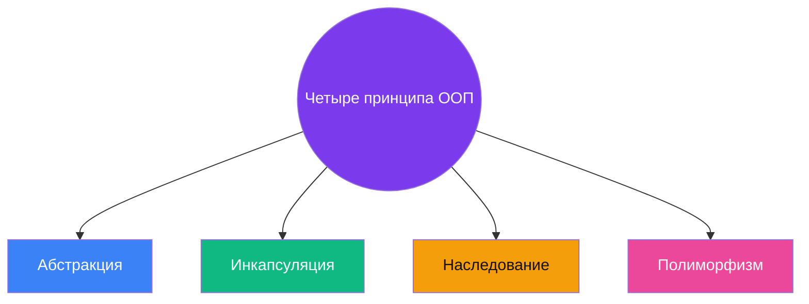
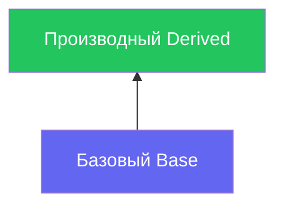

<!-- Конспект оптимизирован под GitHub Flavored Markdown: алерты, Mermaid, details -->

<a id="top"></a>

<div align="center">

# Краткий конспект: ООП и C# 7.0

[](https://learn.microsoft.com/dotnet/csharp/)
[](https://github.com/topics/object-oriented-programming)
[](https://github.github.com/gfm/)

*Принципы → классы → наследование → абстракция и интерфейсы → коллекции → файлы*

</div>

---

## Содержание

| Раздел | Тема |
|:------:|------|
| [1](#sec-1) | Классы, свойства, перечисления, `Object` |
| [2](#sec-2) | Наследование и модификаторы |
| [3](#sec-3) | Абстрактные классы и интерфейсы |
| [4](#sec-4) | Массивы, индексаторы, коллекции |
| [5](#sec-5) | Работа с файловой системой (`System.IO`) |
| [★](#sources) | Дополнительные источники |

<details>
<summary><strong>Как читать цветные блоки на GitHub</strong></summary>

В тексте используются [алерты GFM](https://docs.github.com/en/get-started/writing-on-github/getting-started-with-writing-and-formatting-on-github/basic-writing-and-formatting-syntax#alerts):

| Блок | Когда смотреть |
|------|----------------|
| **Note** | Определения и справка |
| **Tip** | Советы к зачёту / экзамену |
| **Important** | Обязательно запомнить |
| **Warning** | Типичные ошибки и ловушки |

Код — в блоках с подсветкой `csharp`. Схемы — **Mermaid** (рендерится на GitHub).

</details>

---

## Введение в ООП

### Базовые понятия

| Понятие | Смысл |
|:--------|:------|
| **Объект** | Сущность со **свойствами** (данные) и **методами** (поведение). |
| **Класс** | **Шаблон** для создания объектов. |

### Четыре столпа ООП

| | Принцип | Коротко |
|--:|---------|---------|
| 🧠 | **Абстракция** | Главное без лишнего. |
| 🔒 | **Инкапсуляция** | Детали за интерфейсом. |
| 🌿 | **Наследование** | Иерархии и переиспользование. |
| 🎭 | **Полиморфизм** | Один контракт — разное поведение. |



> [!TIP]
> На экзамене часто просят **сформулировать** принципы и **привести пример из кода**: свойства → инкапсуляция; `virtual` / `override` → полиморфизм.

> [!NOTE]
> **Проверь себя:** чем *абстракция* отличается от *инкапсуляции* одним предложением?

---

<a id="sec-1"></a>

## 🧱 1. Классы, свойства, enum, Object

### Классы и конструкторы

```csharp
class Man {
    public string FirstName;
    public int Age;

    // Конструктор по умолчанию
    public Man() { }

    // Конструктор с параметрами
    public Man(string name, int age) {
        FirstName = name;
        Age = age;
    }
}

// Создание объекта
var person = new Man("Иван", 30);
```

> [!NOTE]
> **`namespace`** — организуют классы и снимают конфликты имён. Внутри своего пространства — без лишних `using`.

### Свойства (properties)

- Инкапсулируют доступ к полям → компиляция в `get` / `set`.
- **Автосвойство:** `public string Name { get; set; }`
- Валидация в `set`:

```csharp
private int _age;
public int Age {
    get => _age;
    set {
        if (value > 0 && value < 120) _age = value;
        else Console.WriteLine("Некорректный возраст");
    }
}
```

### Перегрузка операторов

```csharp
public static bool operator ==(Man a, Man b) {
    return a.Age == b.Age && a.FirstName == b.FirstName;
}
public static bool operator !=(Man a, Man b) => !(a == b);
```

### Перечисления (`enum`)

```csharp
enum DayOfWeek { Monday, Tuesday, Wednesday }    // по умолчанию 0,1,2
enum Status : byte { Active = 1, Inactive = 2 }  // явный тип и значения
```

### Методы `Object`

| Метод | Назначение |
|-------|------------|
| `ToString()` | Строка (виртуальный). |
| `Equals()` / `GetHashCode()` | Переопределять **вместе**. |
| `ReferenceEquals()` | Сравнение ссылок. |
| `GetType()` | Тип объекта. |
| `MemberwiseClone()` | Поверхностная копия. |

### Структуры (`struct`)

- **Значимый тип**, стек; присваивание = копия значения.
- В метод — по значению (копия).

> [!WARNING]
> **`class` vs `struct`:** `class` — ссылочный тип; `struct` — значимый. Частый вопрос: память, присваивание, передача в метод.

---

<a id="sec-2"></a>

## 🔗 2. Наследование и модификаторы

### Наследование

```csharp
class Derived : Base { }
```



> [!IMPORTANT]
> **Мнемоника модификаторов**
>
> | Ключ | Образ |
> |------|--------|
> | `private` | только «я» |
> | `public` | «все» |
> | `protected` | «семья» + наследники |
> | `internal` | «вся сборка» |
> | `sealed` | «точка», дальше нельзя |

| Модификатор | Доступ |
|---------------|--------|
| `private` | Только внутри класса |
| `public` | Везде |
| `protected` | Класс + наследники |
| `internal` | Текущая сборка |
| `sealed` | Запрет наследования / дальнейшего `override` |

### Вызов конструкторов

Сначала **базовый**, потом **производный** конструктор.

```csharp
public Derived(int x) : base(x) { }
```

### Приведение типов

- **Up Cast** → к базовому (безопасно).
- **Down Cast** → к производному (`is` / `as`).

```csharp
if (obj is Derived derived) { /* используем derived */ }
Derived d = obj as Derived;
if (d != null) { /* ... */ }
```

### `virtual` / `override`

- `virtual` — можно переопределить.
- `override` — переопределение.
- `sealed override` — стоп дальнейшим наследникам.

### Композиция и агрегация

> [!TIP]
> **Образы:** **Композиция** — часть не живёт без целого (дом и комната). **Агрегация** — часть автономна (университет и студенты).

---

<a id="sec-3"></a>

## 📜 3. Абстракция и интерфейсы

### Абстрактный класс

- Нельзя создать экземпляр абстрактного класса.
- Могут быть абстрактные члены без реализации.
- Абстрактный класс не может быть `sealed` или `static`.

```csharp
abstract class Shape {
    public abstract double Area();   // нет реализации
    public void Display() { }        // обычный метод
}
```

### Интерфейсы

- Контракт: класс **обязан** реализовать.
- Несколько интерфейсов на один класс — **да**.

```csharp
interface IDrawable {
    void Draw();
}
class Circle : IDrawable {
    public void Draw() { Console.WriteLine("Рисуем круг"); }
}
```

| | Абстрактный класс | Интерфейс |
|--|-------------------|-----------|
| **Задача** | Общая база + «дыры» под наследников | Только поведение |
| **От чего наследуются** | Один базовый класс | Много интерфейсов |
| **Поля / код** | Поля и методы с телом | Сигнатуры; в C# 8+ бывают default-методы |

> [!TIP]
> *Абстрактный класс* — **частично готовый чертёж**. *Интерфейс* — **список обязанностей** для класса.

---

<a id="sec-4"></a>

## 📚 4. Массивы и коллекции

### Массивы

```csharp
int[] arr = new int[5];           // одномерный
int[,] matrix = new int[3,4];     // прямоугольный
int[][] jagged = new int[3][];    // зубчатый
```

### Индексаторы

```csharp
public int this[int index] {
    get => _data[index];
    set => _data[index] = value;
}
```

### `params`

```csharp
void Sum(params int[] numbers) { /* ... */ }
```

### `System.Collections` и `Generic`

> [!WARNING]
> **`ArrayList`** хранит `object` → приведения, boxing/unboxing. Для учебы — удобно; в продакшене чаще **`List<T>`**.

- `Queue` — FIFO 🛒
- `Stack` — LIFO 🍽️

```csharp
List<int> numbers = new List<int> { 1, 2, 3 };
Dictionary<string, int> ages = new Dictionary<string, int>();
```

---

<a id="sec-5"></a>

## 💾 5. Файлы и System.IO

> [!NOTE]
> **Карта классов**
>
> | Класс | Роль |
> |-------|------|
> | `DriveInfo` | Диски, свободное место |
> | `File` / `FileInfo` | Статика vs экземпляр |
> | `Directory` | Каталоги |
> | `Path` | Парсинг пути без I/O |
> | `Stream*` | Байты и текст |

### `DriveInfo`

```csharp
DriveInfo[] drives = DriveInfo.GetDrives();
foreach (var d in drives)
    Console.WriteLine($"{d.Name} – {d.TotalFreeSpace} байт свободно");
```

### `File` · `FileInfo` · `Directory` · `Path`

- **File** — `Create`, `Copy`, `Move`, `Delete`, `Exists`, `AppendAllText`…
- **FileInfo** — экземпляр; `Open` + `FileMode`, `FileAccess`, `FileShare`.
- **Directory** — `GetFiles`, `GetDirectories`, `CreateDirectory`…

```csharp
string full = Path.GetFullPath("file.txt");
string ext = Path.GetExtension("file.txt");   // ".txt"
```

### Потоки

- `Stream` — байты.
- `StreamReader` / `StreamWriter` — текст.

### Сериализация

| Тип | Особенности |
|-----|-------------|
| **Бинарная** (`BinaryFormatter`) | `[Serializable]` |
| **JSON** (`Newtonsoft.Json`) | Обмен и читаемость |

---

<a id="sources"></a>

## Источники

> [!NOTE]
> **Литература и документация**
>
> - Джеффри Рихтер — «CLR via C#»
> - Эндрю Троелсен — «C# 7 и платформа .NET»
> - [Microsoft Learn — C#](https://learn.microsoft.com/dotnet/csharp/)

<details>
<summary><strong>О пособии</strong></summary>

Конспект по первой части учебного пособия «Объектно-ориентированное программирование» (Степанов, Кабанов, Никонов, Павлюченко, 2021).

</details>

---

<div align="center">

**Темы для поиска в репозитории:** `ООП` · `C#` · `конспект`

[↑ Наверх](#top)

</div>
